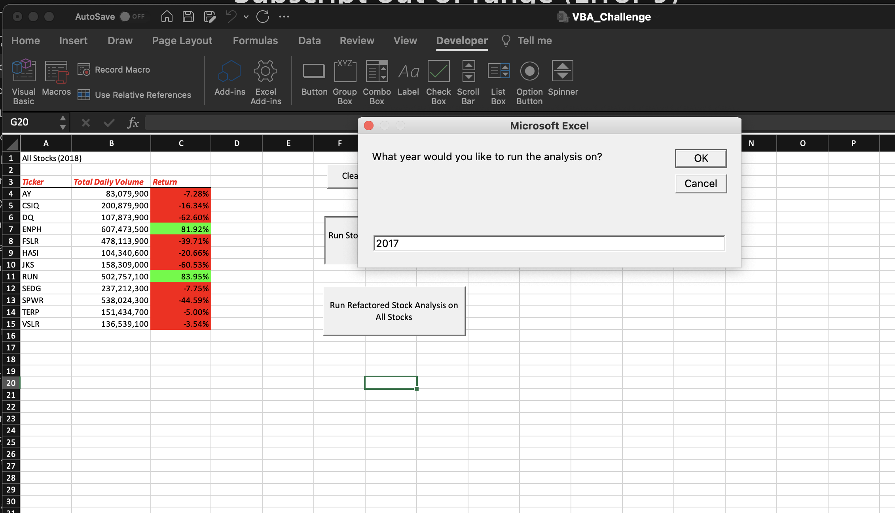
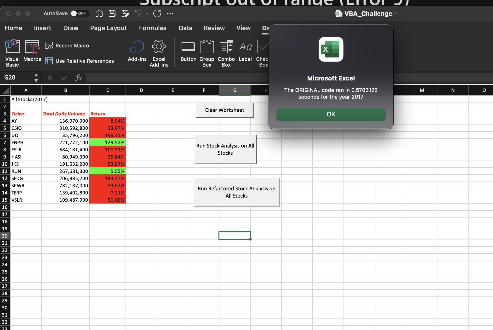
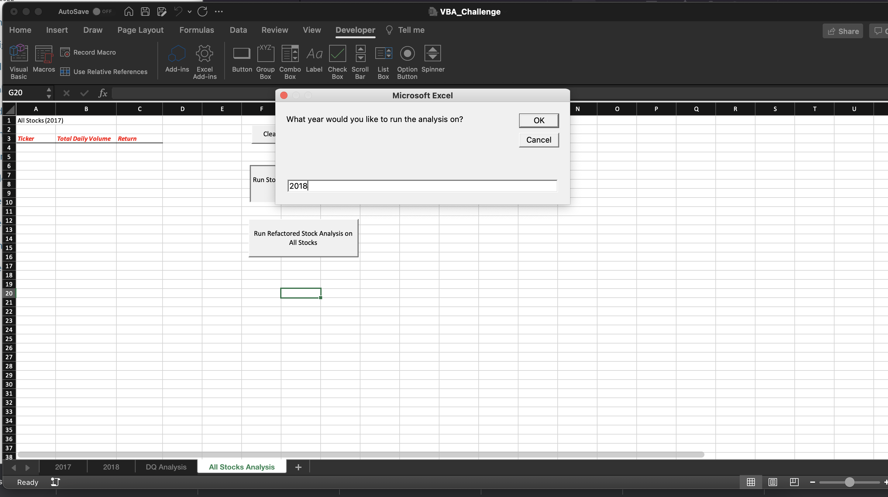
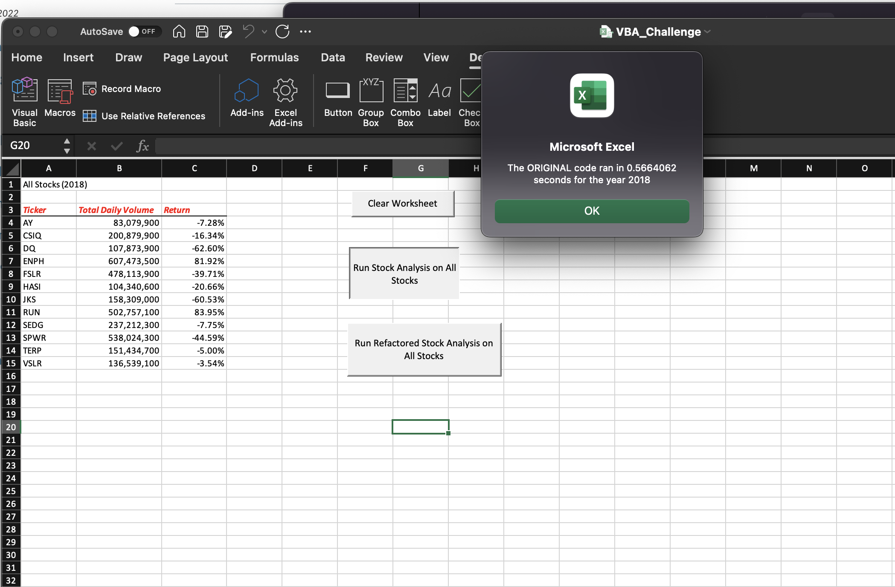
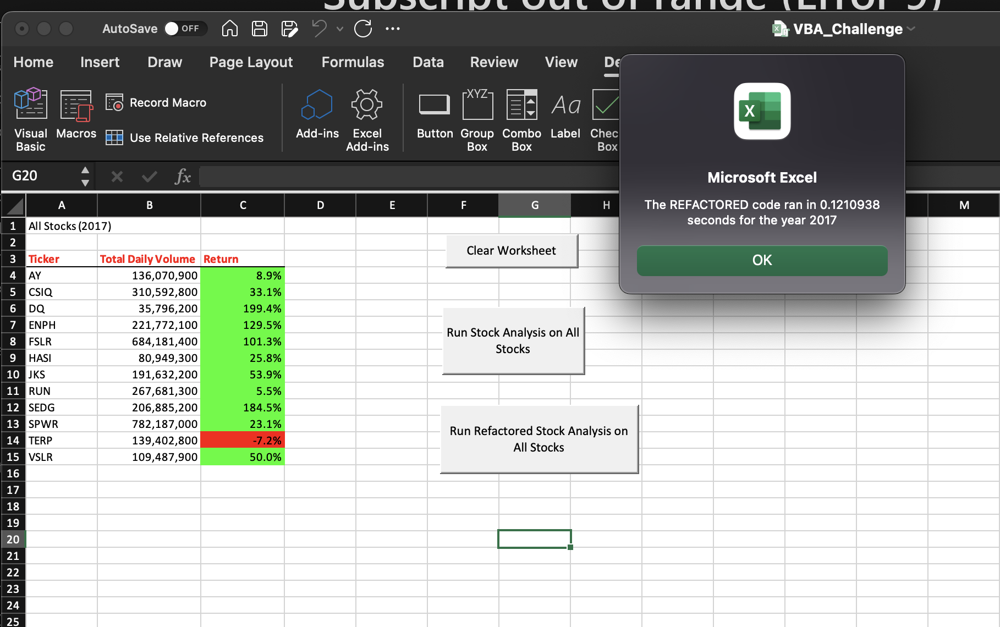
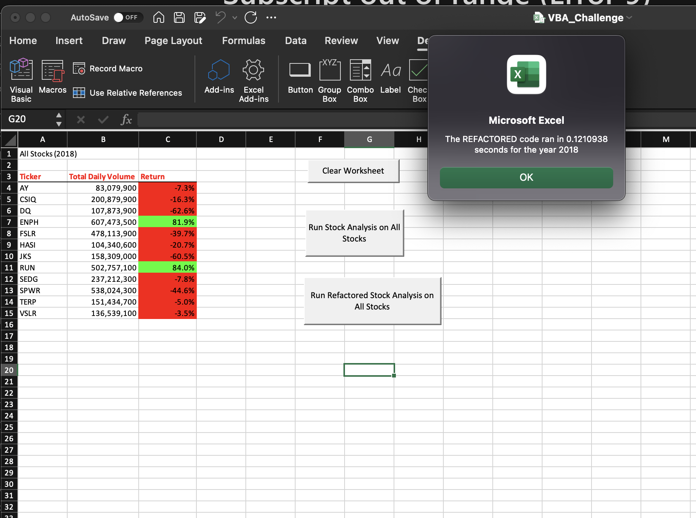

# Stock Analysis Refactor

## Overview of Project
This project is to refactor our stock analysis code to be more performant should we decide to scale up the amount of data.
Currently, the code runs well on the limited data set that it is currently run on. In the event that the data set increases, we want to make
sure that the code runs in a reasonable amount of time.
This project intends to show the run times of the current code against the current data set verses the run times of the refactored code
against the same set. The goal is to get shorter run times when the code is written. Which would signify that the code can handle
an increased set of data.

## Results
Here is the runtimes for both years on the current code:

During the 2017 data select the *ORIGINAL* code ran for **0.5703125** seconds

During the 2018 data selection the *ORIGINAL* code ran for **0.5664062** seconds

Here are the resulting run times after the refactoring of the code:

During the 2017 data selection the *REFACTORED* code ran for **0.1210938** seconds

During the 2018 data selection the *REFACTORED* code also ran for **0.1210938** seconds

## Summary
In summary, looping through the stock data and outputing the results in Single data type arrays saves us memory and speed.
